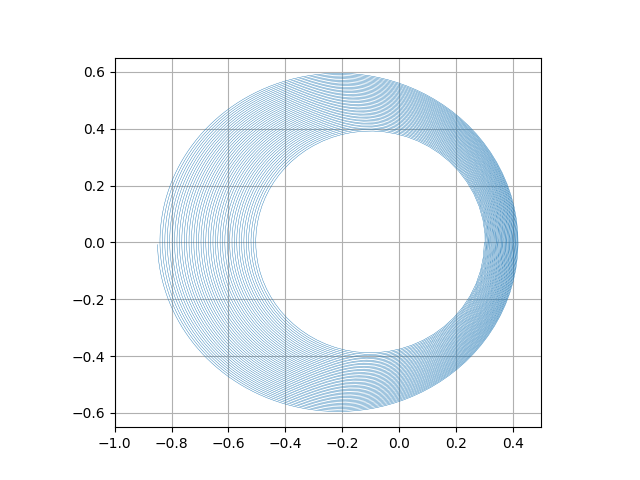
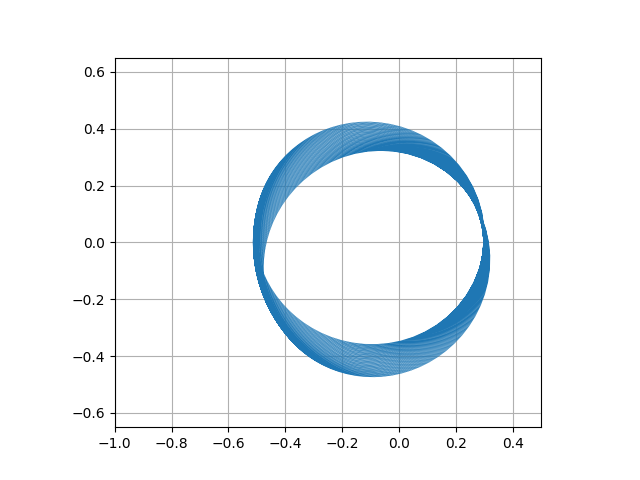

# 微分方程

## 介绍

在这个代码题中，你将使用 `python` 尝试解决简单的常微分方程(ODE)问题和偏微分方程(PDE)问题。你可以通过运行 `python ode.py` 和 `python laplace.py` 来生成算法结果。

## ODE

计算质点的运动轨迹是典型的 ODE 问题。考虑二维平面上一个质点在原点的万有引力作用下进行运动，你需要补充在 `utils.py` 中补充未完成的函数部分。具体来说，你需要在 `explicit_euler` 实现显式欧拉积分：

$$
\vb*{x}^{n+1}=\vb*{x}^{n}+\vb*{v}^{n}\Delta t\text{,}\\
\vb*{v}^{n+1}=\vb*{v}^{n}+\vb*{a}(\vb*{x}^{n})\Delta t\text{.}
$$
实现效果如下图：

显然，显式欧拉积分的误差导致质点逐渐偏离椭圆轨迹。我们可以使用一个简单的改进方案：辛欧拉(Symplectic Euler)积分。请根据您所推导出的一阶辛欧拉积分格式，补充 `symplectic_euler`，实现效果如下图：

这一次，轨迹的偏离情况变好许多。辛欧拉积分一个有趣的性质是其轨迹围成的面积总是不变的。更好的改进包括使用中点法和龙格-库塔法等高阶ODE积分方法，有兴趣的同学可以尝试。

## Laplace方程

Laplace 方程是图形学中常见的一类 PDE 问题，其形式为

$$
\nabla^2 u=0.
$$
接下来你需要求解带 Dirichlet 边界条件的二维 Laplace 方程。我们使用均匀网格离散化矩形区域 $[0,1]\times[0,1]$，将标量场 $u$ 存储为二维 $N\times N$ 矩阵，并使用有限差分的 Jacobi 迭代求解该问题。具体来说，$\nabla^2 u$ 被离散为

$$
(\nabla^2 u)_{i,j}=\frac{u_{i+1,j}+u_{i-1,j}+u_{i,j+1}+u_{i,j-1}-4u_{i,j}}{\Delta x^2}.
$$
进而由Laplace方程得到

$$
u_{i,j}=\frac{u_{i+1,j}+u_{i-1,j}+u_{i,j+1}+u_{i,j-1}}{4}.
$$
Jacobi 迭代算法的等式为

$$
u_{i,j}^{n+1}=\frac{u_{i+1,j}^n+u_{i-1,j}^n+u_{i,j+1}^n+u_{i,j-1}^n}{4}.
$$
由此我们不断迭代该矩阵直到收敛。在本次作业的实现中，你需要实现 `utils.py` 中的 `iter_jacobi` 函数。我们指定 $u$ 的边界条件：$u_{0,j},u_{N-1,j},u_{i,0},u_{i,N-1}$ 为指定常数。所以 `iter_jacobi` 应当遍历矩阵的 $(N-2)\times(N-2)$ 区域，应用上述 Jacobi 迭代等式。算法实现的效果如下：

没有预处理的 Jacobi 迭代算法是低效的，迭代 300 步并不能完全收敛。

## 提交

将完成以后的 `utils.py` 提交即可。