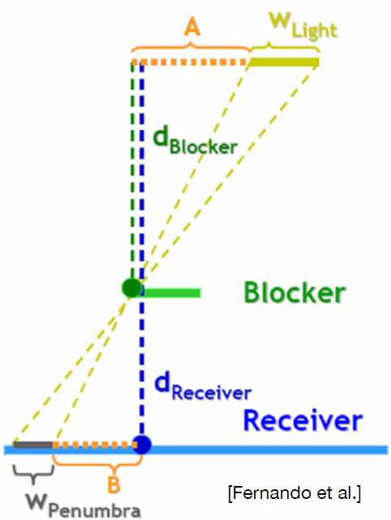

# Contents

- Recap: Shadow Mapping
- the Math behind Shadow Mapping
- Percentage Closer Soft Shadows (PCSS)

## 阴影映射(Shadow Mapping)

一般的阴影映射算法是一个2步算法（2-pass algorithm）：

1. 从光源出发，渲染一张从光源出发的深度图，这张图叫做shadow map
2. 从摄像机出发，渲染一张从摄像机出发的图像，这张图叫做image space
3. 在image space中，对于每一个像素，计算它到光源的距离，并与shadow map中的深度值进行比较，如果距离小于深度值，则该像素在阴影中，否则不在阴影中。

### 阴影映射面对的问题（Issues of Shadow Mapping）

#### 1. 自遮挡问题（Self-Occlusion）

（p.s.:阴影中的异常纹路,如下图）

当从光源看向场景时，会记录场景中像素的深度；但是从相机看向场景时，见到的像素和光源见到的像素并不相同，因此会产生自遮挡问题。其本质是shadow map的精度问题，导致阴影的边缘锯齿化。

这种现象在光源和相机观察角度相差很大时尤为明显。比如说光源和相机观察角度相差很大时，阴影的边缘会非常明显，产生锯齿化。

#### 解法1：加入偏差深度（bias）

对shadow map的深度值加入一个偏差，使得shadow map的深度值大于实际深度值，从而避免自遮挡问题。

但是这样又可能出现另一个问题：如果这个偏差过大，可能会导致阴影断开，产生漏光现象，如下图：
（If the bias is too large, the shadow may break and cause light leakage.）

#### 解法2：中值偏差（Median Bias）

将同一方向上的最小两个实际深度值的平均值作为Shadow map的深度值。

这个方法有一个前提条件，就是同一方向上必须存在两个以上的深度值（部分地方可以添加一个很小的厚度解决这个问题。另外，因为这个方法需要计算两遍深度图，因此效率较低。
*（p.s:在实时渲染中，一般的时间复杂度并不靠谱，因为实时渲染必须还要考虑常数项）*

### 走样（Aliasing）

这是由于阴影映射的分辨率问题导致的。工业界一般使用动态调整分辨率的方法来解决这个问题。下面是一个走样问题的示例：

## 阴影映射背后的数学原理（The Math behind Shadow Mapping）

在上一节课的时候我们讲到，渲染方程在实际计算中非常的耗时，因此我们需要使用一些近似的方法来计算积分项。

1. 施瓦茨不等式（Schwarz Inequality）
   施瓦茨不等式可以写成如下形式：
   $$
   \int_{\Omega} f(x)g(x)dx \leq \sqrt{\int_{\Omega} f^2(x)dx} \sqrt{\int_{\Omega} g^2(x)dx}
   $$
2. 闵可夫斯基不等式（Minkowski Inequality）
   闵可夫斯基不等式可以写成如下形式：
   $$
   \sqrt{\int_{\Omega} (f(x) + g(x))^2dx} \leq \sqrt{\int_{\Omega} f^2(x)dx} + \sqrt{\int_{\Omega} g^2(x)dx}
   $$

类似上面的两个不等式，实时渲染中也有对应的简化计算的近似方法，就是下面这个式子：
$$
\int_{\Omega} f(x)g(x)dx \approx \frac{\int_{\Omega} f(x)dx} {\int_{\Omega}dx} \cdot \int_{\Omega} g(x)dx
$$

这里不做证明，但是我们需要知道这个式子什么时候更加准确：

- 当$f(x)$和$g(x)$都比较平滑的时候，这个式子更加准确
- 当$f(x)$和$g(x)$都不平滑的时候，这个式子不够准确

那么根据这个式子，我们可以将渲染方程写成如下形式：
*（p.s: 我们将$L_i$和$V$写成$f$，$f_r$写成$g$）*
$$
\frac{\int_{\Omega} V(p,\omega_i)cos\theta_i    d\omega_i}{\int_{\Omega}cos\theta_i d\omega_i} \cdot \int_{\Omega} f_r(p,\omega_i,\omega_o)  L_i(p,\omega_i)cos\theta_i d\omega_i
$$

那么，前一项可以看作是visibility项，后一项可以看作是渲染方程的shading项，渲染方程的积分项可以近似为这两项的乘积。

这个积分什么时候更加准确呢？

- small support: 当光源比较小的时候，积分域比较小，这个式子更加准确
- smooth integrand：当光源比较平滑的时候（面光源），这个式子更加准确。对于Shading项来说，如果他是漫反射的，那么Shading项比较平滑。

**这个估算方法在实时渲染中非常有用，因为实时渲染中往往需要估算渲染方程的积分项，而这个估算方法可以帮助我们快速估算渲染方程的积分项。事实上，在光照遮挡中，我们也会使用这个方法。**

上面的内容是硬阴影的处理方法，下面我们来看软阴影。

## Percentage Closer Soft Shadows (PCSS)

PCSS是一种基于阴影映射的软阴影算法，它通过在阴影映射中加入一个半影区域来让阴影看起来更加自然。

PCSS在硬阴影的基础上引入了PCF（Percentage Closer Filtering）处理方法。这个方法最初是用来处理走样问题的，后来被引入到阴影映射中来处理软阴影。

### PCF

PCF的过程如下：

1. 在目标像素周围随机采样，计算每个采样点的深度值（比如，周围的3x3的区域）(perform nultiple depth comparisons)
2. 将该点深度值与这些深度值进行比较，如果该点深度值小于这些深度值则记为0，否则记为1.(get the comparison result)
3. 计算阴影的比例（0，1求平均），这个比例就是软阴影的强度。(take average of the comparison result to get visibility)

但是这种方法非常的慢（如果取kxk的区域，那么就需要9次深度比较，因此慢了$k^2$倍）

### PCF面临的问题

在PCF取样中涉及到了一个参数k，那么这个k值如何确定呢？

- 如果k值太小，那么阴影的边缘会比较生硬
- 如果k值太大，那么阴影的边缘会比较模糊

因此，我们需要找到一个合适的k值，使得阴影的边缘既不会太生硬也不会太模糊。

另外我们还需要确定k值是处处相同的，还是根据实际需要而变化的。答案是，k值应该根据物体到阴影的距离而变化。

为什么是根据物体到阴影的距离而变化呢？请看下图：

### 计算公式

$$
    \omega_{penumbra} = \frac{z_{receiver} - z_{blocker}}{z_{blocker}} \cdot \omega_{light}
$$

具体请看下图：

总而言之，PCF就是一个取周围平均的过渡，而PCSS则是根据距离调整半影区域的PCF。

### PCSS的完整算法

1. 确认是否被遮挡（在特定范围内搜索是否有遮挡物）（Blocker Search）
2. 计算半影区域的大小(penumbra estimation)
3. 进行PCF处理(percentage closer filtering)
*(p.s：上面的情况是单个光源的，那么多个光源应该如何处理呢？没办法，只能每个光源都计算一遍)*
*(PCF中的k是计算半影区域的大小，那么"在特定区域中搜索遮挡物"中的特定区域如何确定呢？答案是，一般取一个固定数值，例如5x5的区域，当然可以和半影区域的计算方法结合起来，即heuristic方法)*

## 总结

- 阴影映射的问题主要有自遮挡问题和走样问题。可以通过加入偏差深度和加入中值偏差来部分解决自遮挡问题。工业界通过调整分辨率来解决走样问题。
- 在实时渲染中，我们往往需要估算渲染方程的积分项，而将积分分为visibility项和shading项的乘积可以帮助我们快速估算渲染方程的结果。
- PCSS通过在阴影映射中加入一个半影区域来让阴影看起来更加自然。
- PCSS的Blocker Search和Penumbra Estimation是PCSS的核心算法。
