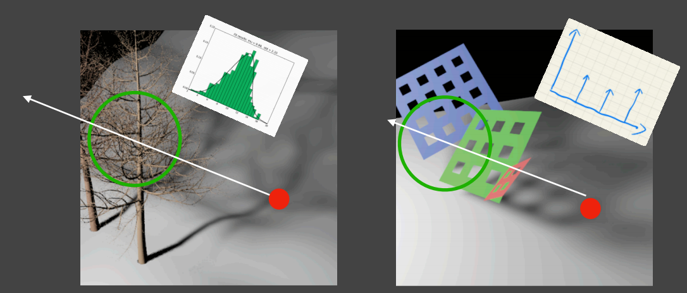
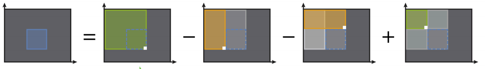

# Contents

- Basic filtering techniques
- Variance Soft Shadow Mapping
- MIPMAP and Summed-Area Vaiance Shadow Maps
- Moment Shadow Mapping

## Basic Filtering Techniques

PCF可以看作一种卷积，取平均（加权平均）即取卷积核。也就是说，在PCSS中：
$$
 V(x) = \Sigma_{q\in N(p)}\omega(p,q) \cdot D[D_{sm}(q)-D_{scene}(x)]
 $$

由上可知，PCF并非直接对SM或者对图像操作，而是比较SM的结果后进行卷积，而不是卷积后比较，也不是先输出结果后进行模糊。

但是在上节课也提到，PCSS很慢，那么有没有什么加速的方法呢？

答案是有，就是从比较附近所有的Shadow Map深度改为从周围的Shadow Map深度中随机采样进行比较，将结果输出。但是这样一定会有阴影的噪声。没关系，这个可以在后期的图像处理中进行降噪。

## 方差软阴影映射(Variance Soft Shadow Mapping)

VSSM产生的契机，依然是PCSS采样实在是太慢了，因此产生了对应的加速方法VSSM。

VSSM的原理是什么？这涉及对阴影映射深度值比较的另一种看法。

在PCSS中，我们将看到的某个像素的深度值和阴影映射中该像素附近区域的像素值进行比较，然后计算该点深度值大于采样区域深度值占所有采样深度值的比例（也就是名字中的Percentage），然后进行对应比例的阴影处理（0就是全白，1就是全黑，线性过渡）。

那么，视角中不同的深度值就会有不同的结果，且无限近的时候，百分比值是0，无限远的时候，这个值是1，而且百分比一定随着深度值增加而递增。我们做一个百分比-深度值函数，这个函数就类似一个概率论中的分布函数。那么我们就可以运用概率论中分布函数的性质来研究这一步。

### 切比雪夫不等式的应用

概率论中的切比雪夫不等式提到：
$$
    P(x>t) \leq \frac{\sigma^2}{\sigma^2 + (t-\mu^2)}
$$
这个公式可以逆向告诉我们累积分布函数的值，也就是$P(x\leq t)$的值，正好可以用于计算我们PCSS中的百分比。

切比雪夫不等式虽然是一个非常粗糙的不等式，但是好处就在于它不要求分布函数满足特定的分布才能成立。那么运用这个不等式计算百分比的时候，我们还要知道什么呢？就是不等式中残缺的参数：均值$\mu$和方差$\sigma$。没错，这就是这种方法为什么叫做“方差”软阴影映射的原因。

但是切比雪夫等式有一个限制条件：一般$t \geq \mu$的时候表现较好，否则估计值就差了很多。但是无所谓，

### VSSM的表现

毫无疑问，用了上面跳了一万步的近似公式，VSSM快了很多很多。

- 开销：两张Shadow Map
- 运行时间：
    深度值均值：O(1)
    深度值平方均值：O(1)
    切比雪夫不等式计算：O(1)

### 遮挡物搜寻估计

遮挡物搜寻(Blocker Search)这一部分也涉及区域遍历，相当的慢。我们有没有什么好方法呢？

我们的目标是搜寻遮挡物的平均深度$z_{occ}$，而现在我们可以轻松得到区域所有的平均$z_{avg}$，而这两个值满足以下公式：
$$
    \frac{N_1}{N}z_{occ} + \frac{N_2}{N}z_{unocc} = z_{avg}
$$
巧了，根据上面的切比雪夫不等式我们可以估算$\frac{N_2}{N}$，那么$\frac{N_1}{N}$就是$1-\frac{N_2}{N}$，要求目标我们只剩了最后一个未知量$z_{unocc}$
*p.s:VSSM大胆假设，$z_{unocc} = t$ 。这个假设是说这个区域内没有被遮挡的部分和着色点(分布函数的值$t$)在同一个平面上。*
*管他呢，反正节省了计算量，而且结果看起来也不错。*

### VSSM的限制

由上面的假设来看，VSSM在作平面接受阴影的效果上非常适合。但是在曲面以及和光线不垂直的情况下表现不佳。另外，在分布非常不均匀的情况下，VSSM的效果也不好，如下图：

## MIPMAP和二维前缀和阴影映射（MIPMAP and Summed-Area Vaiance Shadow Maps）

为什么VSSM需要MIPMAP？我们知道MIPMAP可以将图像转换为不同分辨率而保留原来的特征。从高分辨率转换为低分辨率时，MIPMAP就涉及多个像素颜色求**均值**的问题，因此用在这里非常适合。

那么方差怎么解决呢？很简单，根据概率论公式：
$$
    Var(X) = E(X^2) - E^2(X)
$$
我们只需要再计算以下深度值平方的平均值就可以了。这个计算非常简单，只需要在记录阴影映射深度值的时候，顺手平方一下记录在另一个阴影映射就可以了。在生成MIPMAP的时候也是生成两个MIPMAP，方差只需要查询对应的值相减即可。
*（p.s:这种方法并没有什么开销。时间开销自然是不多的，而一个阴影映射和MIPMAP也不会占用什么存储空间）*

### MIPMAP的计算方法

如何实现MIPMAP这种快速近似的方形范围的查询方法呢？

数字图像可以砍成一个二维列表，每个元素是一个三元组(RGB，或者别的数的元组)。我们这里简化为二维数组，假设我们要做的方形查询左上角坐标是$(x_1,y_1)$，右下角是$(x_2,y_2)$，如何实现一个快速查询呢？二维前缀和出场，如下图：

求平均可以简单的看成求和。我们维护一个二维前缀和数组$sum$，保存起点到当前点的所有数的和。那么记方形查询范围内的和是$S$，有：
$$
    S = sum(x_2,y_2) - sum(x_1,y_2) - sum(x_2,y_1)+ sum(x_1,y_1)
$$
将时间复杂度简化到了O(1)，非常不错。

但是这样的话构筑一个前缀和数组也有一定的开销，怎么办呢？实际GPU操作中可以使用并行计算加速。

### 小结

VSSM是一种非常具有开创性的方法，大大简化了计算量，曾经非常红火。但是随着GPU计算量的提升，PCSS重回战场，而细节并不出众的VSSM被淘汰出局。

## 矩计算软阴影映射(Moment Shadow Mapping)

MSM是VSSM的改进版。之前我们提到，VSSM是基于均值和方差来估计分布函数的，而方差就是二阶中心距。因此VSSM属于一种“二阶矩计算软阴影映射”。

在MSM中，一般使用更高阶的矩来估计分布函数。权衡计算量和效果之后，四阶矩被认为是一个较好的选择。

MSM作为VSSM的改进版在以前非常红火，但是同样地随着PCSS重回战场，这种方法现在也几乎不被使用了。

## 总结

上节课讲到的PCSS相当于遍历所有纹素得到一个景区的深度值-卷积阴影分布，而VSSM和MSM相当于对这个分布函数做了一个多项式逼近。
