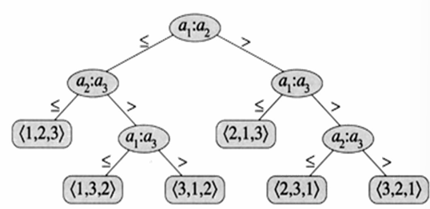

# Lecture1: Game Theory

- **2-player Zero Sum Game**
- **Minimax Optimal  Strategies**
- **Von Neumann's Minimax Theorem**
- **Lower Bounds for Randomized Algorithms**
- **General sum games, Nash quilibria**

## 2-Player Zero sum Game 二人零和博弈

一个博弈包括以下要素：

- 参与者，称为玩家
- 每个玩家都有一组选择，称为动作。
- 不同玩家的联合动作会给每个玩家带来反馈

### Example: shooter goalie game 射手门将博弈

对于射手来说，他可以选择向左或者向右射门；对于门将来说，它可以向左或者向右扑救。

收益：如果二者选择了相同的方向，门将完成了一次扑救获得1分，射手丢失1分；否则射手获得1分，门将丢失1分。

### 收益矩阵

|   | 左 | 右 |
|---|---|---|
| 左 | (-1,1) | (1,-1) |
| 右 | (1,-1)  | (-1,1) |

矩阵中的每一个元组对应一组反馈，其中第一个数$R_{ij}$对应行玩家行动的反馈，第二个数$C_{ij}$对应列玩家。

如果在零和博弈中，$R+C=0$。

### 期望收益

每个玩家的期望收益为两位玩家执行某行动的概率和该行动对应的玩家收益乘积的总和，也就是：
$$
    V(p,q) = p_i q_j P_{ij}
$$
其中p是行玩家执行对应动作的概率，q是列玩家对应动作的概率，假设两位玩家行动相互独立。

在零和博弈中，$V_R + V_C = 0$。

## Minimax Optimal Strategies 最优策略

任何一个玩家都希望最大化其期望收益，而在零和博弈中，一个玩家的收益增加代表另一个减少等量增益。因此一个玩家会尽量减少另一位玩家的期望收益。那么行玩家的策略期望最小收益可以表示如下：
$$
    lb = \max_p \min_q V_R(p,q)
$$
下面我们证明一个规律：
$$
    \max_q \min_p V_C(p,q) = -\min_q \max_p V_R(p,q)
$$
证明如下：
$$
    \max_q \min_p V_C(p,q) = -\max_q \min_p V_R(p,q)
    = \max_q (-\max_p V_R(p,q))
    = -\min_q max_p V_R(p,q)
$$
这个规律说明最大化本人最小收益就相当于最小化对手最大收益的相反值。

由此可见，你要最小化你的对手的最大收益，同理你的对手也要最小化你的最小收益。也就是说，你决定你的最小收益，你的对手决定你的最大收益。那么这两个值如何对应呢？

## Von Neumann's Minimax Theorem 冯·纽曼定理

在一个有限操作的双方零和博弈中，某玩家的期望收益下界等于期望收益上界。而这个值被称为**value of the game**。

### Lower Bounds for Randomized Algorithms 随机算法的下界

随机算法可以看作一个零和博弈，我们可以建立一个行收益矩阵：

- 每一行对应不同的输入
- 列对应不同的算法
- $R_{i,j}$对应不同的开销（比如，时间复杂度）

一个有最坏情况最优的确定算法是某一个所有对应值都最小的列。

一个有最优期望的随机算法是指一个对应列的分布q使得每行的期望开销都是最小的。

我们刚才提到我们要使得最坏情况最优，也就是
$$
    \min_{randomized} \max_{input} V_R(i,q)
$$

对此有一个定理陈述如下：假设$A$是一个基于比较的随机的排序算法，总存在一个输出$I$使得$A$的期望比较次数是$\Omega(\lg n!)$

其证明如下：

- 假设n个不同数字的排列情况服从均匀分布，我们用一棵树来表示对应不同情况的比较对应的排列：如下图：

- 那么假设n足够大，在深度$lg(n!)-10$之上的叶子有多少个呢？

$$
    \leq 1+2+4+\cdots + 2^{\lg(n!)-1} \leq \frac{n!}{512}
$$

期望深度就是$>.99(\lg(n!)-10)$，因此期望深度就是$\Omega(\lg(n!))$。

## General sum games, Nash quilibria

许多博弈不是零和博弈，存在双赢策略。这种就是**非零和博弈**。

另外，如果在博弈中的参与者都没有动机去单独改变自己的策略（给定其他人的行动），也就是说(p,q)一定是稳定的（为了保证最大期望收益下界），那么这样的一组$((p,1-p),(q,1-q))$就被称作**纳什均衡**。
**纳什定理**对纳什均衡的存在做了肯定。纳什定理的内容是：

**对于给定有限行动的博弈，总存在一个纳什均衡。**
