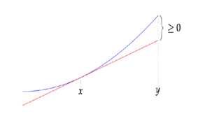
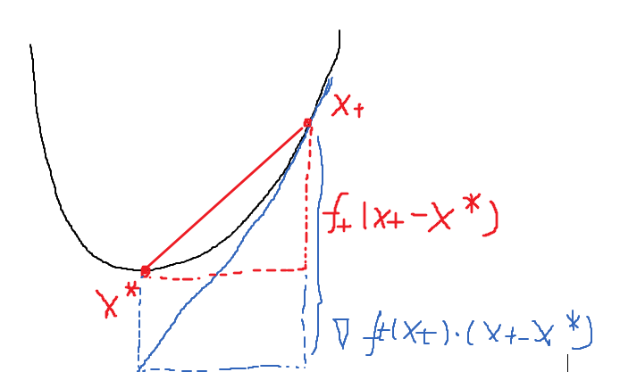

# Lecture 6: Gradient Descent

- **Basic Knowledge**
- **Gradient**
- **Gradient Descent**
- **Online Gradient Descent**

## Basic Knowledge 基础知识

### Norm and Inner Products 范数与内积

2范数：$||\vec{x}|| = \sqrt{<\vec{x},\vec{x}>}$

内积满足数乘和三角不等式：
$$
    ||c\vec{x}|| = |c| ||\vec{x}||\\
    ||\vec{x}+\vec{y}|| \leq ||\vec{x}|| + ||\vec{y}||
$$
但是
$$
    ||\vec{x}+\vec{y}||^2 = ||\vec{x}||^2+||\vec{y}||^2 + 2<\vec{x}\vec,{y}>
$$

### Convexity 凸函数

一般来说，凸指的是如下含义：对于区域$K$，其中$x$，$y\in K$，如果$\forall z = ax+(1-a)y， (a\in[0,1]), z\in K$，那么我们就说$K$是凸的。

同样的，如果对于一个函数，其函数图像上两点连成的线段都在这个函数图像的上方，那么我们就说这个函数是一个凸函数，否则是一个凹函数。也就是：$f(\lambda x+(1-\lambda)y) \leq \lambda f(x)+(1-\lambda)f(y)$

在微积分中，我们曾经提到过，一元函数是凸函数的条件是其二阶导数大于0，也就是$\frac{d^2f(x)}{dx^2}>0$。

如果函数是多元函数，那么就涉及偏微分的概念。这个时候可微多元函数是凸函数的判定就变为：
$$
    f(y)\geq f(x)+<\nabla f(x),y-x>
$$
这里的$\nabla f(x)$就是函数的梯度。

## Gradient 梯度

梯度(gradient)的定义如下：
$$
    \nabla f(\bold{x}) =(\frac{\partial f}{\partial x_1},\dots,\frac{\partial f}{\partial x_n})
$$

有了梯度的概念，理解上面多元凸函数的判定也不难，大致就是一个线性估计法，如下图所示：

## Gradient Descent 梯度下降法

由于梯度是偏导数组成的向量，那么**求多元函数极值的时候，只需要找到梯度等于0的点就可以了**。这个结论为梯度下降法提供了依据。

但是多元函数的情况比较复杂，直接设$\nabla f(x) = \bold{0}$去求解析解一般是非常困难的。所以我们采用一种方法逐步减少梯度直至其达到可以认定为0的程度，这种方法叫做**梯度下降法**。

梯度下降法的基本框架如下：

1. 选取一个基本点$\bold{x_0}$和步数$T$
2. 在每一步执行如下操作：

$$
 x_{t+1}\larr x_t - \eta_t \cdot\nabla f(\bold{x}_t)
$$
得到下一步的迭代点$\bold{x}_{t+1}$
3. 最后返回$\hat{\bold{x}} = \frac{1}{T}\Sigma_{t=0}^{T-1}\bold{x}_t$

其中$\eta_t$被称作“学习度”。

在每一次迭代中，我们向梯度方向的反方向移动来减少损失函数。

在实际操作中，实际上很多时候会直接输出迭代结果$\bold{x}_t$，但是用于证明时则更多使用$\hat{\bold{x}}$，因此这里最终返回$\hat{\bold{x}}$。

### Gradient Descent Convergence 梯度下降法的收敛性

下面我们证明：上面的方法对于所有凸函数是收敛的。也就是，如果评估函数是一个凸函数，梯度下降法不会陷入无限迭代，一定会最终接近目标点。

我们假定$D = ||\bold{x}_0-\bold{x}^*||$是起始点到目标点的**距离**。

然后，我们指定一个上界$G$，使得我们所有的$\bold{x}$均满足$||\nabla f(\bold{x})||\leq G$。

定理表述如下：**对于任何可微凸函数$f:\R^n \rarr \R$，和任何起始点$x_0$，如果我们令$T = (\frac{GD}{\epsilon})^2$，$\eta_t =\eta = \frac{D}{G\sqrt{T}} $，那么有**
$$
    f(\hat{\bold{x}})-f(\bold{x}^*) \leq  \epsilon
$$

其中$D，G$需要我们尝试不同的学习率$\eta$和步数$T$间接得出。

上面的定理被称作**基本梯度下降 Basic Gradient Descent**,下面我们证明其加强定理**在线梯度下降Online Gradient Descent**.

## Online Gradient Descent 在线梯度下降

在线梯度下降和基本梯度下降方式像素。在每一轮迭代，算法使用当前时刻损失函数的梯度更新模型。也就是原来式子中的$f$变成了$f_t$。

下面我们证明:
$$
    \Sigma_{t=0}^{T-1}f_t(\bold{x}_t) \leq \Sigma_{t=0}^{T-1}f_t(x^*) + \frac{\eta}{2}G^2T + \frac{1}{2\eta}D^2
$$

这个式子左边可以简写成$\frac{1}{T}\Sigma_xf(x_t)$，由于是凸函数，因此其大于$f(\hat{x})$，而右边可以简写为$f(x^*)+\epsilon$。

我们使用一个**潜力函数**来证明上面定理。

1. 定义潜力函数

$$
    \Phi_t = \frac{||\bold{x_t}-\bold{x^*}||^2}{2\eta}
$$
那么有$\Phi_0 = \frac{1}{2\eta}D^2$

那么原定理告诉我们：

$$
   \Sigma f_t(x_t) \leq \Sigma f_t(x^*) + \frac{\eta}{2}G^2T + \frac{1}{2\eta }D^2
$$
又因为：
$$
    D^2 = -  \Sigma||\bold{x_{t+1}}-\bold{x^*}||^2 + \Sigma||\bold{x_{t}}-\bold{x^*}||^2
$$
因此我们两边把求和拆开，我们只需要证明：
如下命题
$$
    f_t(x_t) + (\Phi _{t+1} - \Phi_t) \leq f_t(x^*) + \frac{\eta}{2}G^2
$$

由于
$$
    (\Phi _{t+1} - \Phi_t) = \frac{1}{2\eta}(||\bold{x_{t+1}}-\bold{x^*}||^2 + ||\bold{x_{t}}-\bold{x^*}||^2)\\
     = \frac{1}{2\eta}(||\bold{x_{t+1}}-\bold{x_t}||^2 + 2<\bold{x_{t+1}}-\bold{x_t},\bold{x_t}-\bold{x^*}>)\\
     =\frac{1}{2\eta}(||\nabla f_t(\bold{x_t})||^2 - 2\eta<\nabla f_t(\bold{x_t}),\bold{x_t}-\bold{x^*}>)\\
     \leq \frac{\eta}{2}G^2 - <\nabla f_t(\bold{x_t}),\bold{x_t}-\bold{x^*}>
$$

又因为凸函数的特性有
$$
    f_t(x_t) - f_t(x^*) \leq <\nabla f_t(\bold{x_t}),\bold{x_t}-\bold{x^*}>
$$
(p.s.:见下图)

因此[原命题](#jump)得证，我们就证明了在线梯度下降定理。

在线梯度下降的定理是一个基本定理，但是在线梯度下降的方法是什么呢？

## Extra: What is Online Gradient Descent

梯度下降法是一种以线性方式逼近最优点的方法。而OGD（在线梯度下降）和SGD（普通梯度下降）的区别在于其目标函数也是变化的。因此其根据每步收到的数据就能进行梯度下降，而不是像普通的梯度下降，必须收到所有的数据知道$f$之后才能进行梯度下降。
