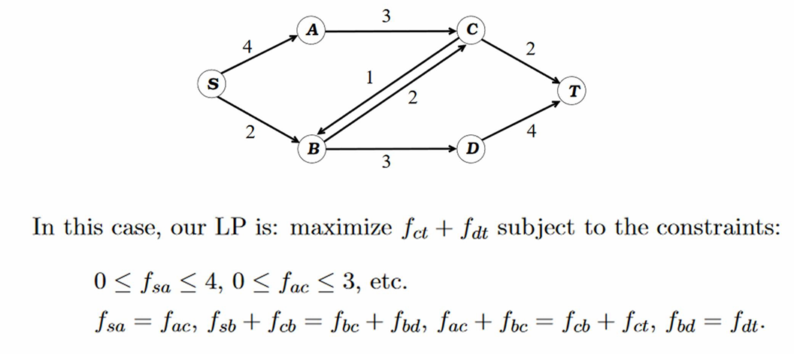

# Linear Programming

- **Definition of linear programming**
- **max and min-cost max flow**
- **linear program to solve minimax optimal strategies in games**
- **Algoithms for linear programming**
- **l1 regression**
- **Seidel's 2-dimensional linear programming algorithm**

## linear program 线性规划

线性规划包含以下几个特征：

1. 包含$n$个变量$x_1,x_2,\cdots,x_n$
2. 所有的限制条件都是变量的线性组合
3. 目标函数也是这些变量的线性组合并且求最大值
4. 没有乘积

所有的限制条件都满足是大于等于（小于等于）的话，这个线性规划称为是**有边界的**，否则就是没有边界的。
对于一些没有边界的线性规划，目标函数可能没有最大值。

## max and min-cost max flow最大流

### Modeling Network Flow

网络流模型是一种常见的算法模型，其主要包含以下几个组成部分：

1. 变量：对于每条边$(u,v)$,$f_{uv}$表示这条边的流的大小
2. 目标：最大化最终节点$T$接收到的流
3. 限制条件：
   - 每条边上的流不能超过这条边的承载能力（每条边上的流存在最大值）
   - 除了源点$S$和最终节点$T$之外，其他节点进入的流量总和等于输出的流量总和。

一个例子如下：

### min-cost max flow 最小开销最大流

每条边$(u,v)$都有一个最大负载$c(u,v)$和成本$w(u,v)$,目标则是设法让每条边流量和单位成本的乘积总和最小，也就是
$$
    \min \sum\limits_{(u,v)\in E}^
    {} w(u,v)f_{uv}
$$

这个问题如何解决呢？

第一种方法：先求最大流$f$，然后优化目标函数。

第二种方法：连接终点和源点$(T,S)$并让这条边的单位成本为一个很大的负值，这样计算目标函数的同时就保证了最大流。

### review: Zero Sum Game

之前的零和博弈和我们刚刚的最大流问题有点相似。他们都有如下的共同点：

变量：一堆变量说明：在零和博弈中是执行各种动作的概率，在最大流问题中是每条边的流量。

目标：都是变量的线性组合。在零和博弈中，是概率和对应收益乘积的总和（收益给定），在最大流问题中，是通往终点所有流量的总和。

约束条件：也是变量的线性组合。

## Linear Program to solve minimax optimal strategies in games

线性规划的一般形式如下：

目标函数：$\vec{c}^T\vec{X}$

约束条件：$A\vec{X} \leq b$

每个约束条件都将变量的向量空间的超平面分割成两个半平面，多个半平面的交集被称为**可行域**。

如果可行域是空集，说明该线性规划是不可行的。线性规划可以是没有边界的，但是一般都是可行的，否则目标函数无解。

一般来说，可行域都是一个凸集。这保证可行域一般只有唯一解。

## Algorithms for Linear Programming

常见的线性规划算法包括：

- Simplex Algorithm 单纯形法：这种方法简单使用，但是在最坏情况下需要指数时间复杂度。
- Ellipsoid Algorithm 椭球算法：具有多项式的时间复杂度，但是实际运行较慢
- Karmarkar's Algorithm(interior point) 卡马卡算法：同样多项式的时间复杂度，而且运行较快

### Simplex Algorithm

单纯形法从可行域的一个顶点开始，依次和附近的点比较，如果发现新的最大值，就进行迁移。

### Ellipsoid algorithm

椭球算法将目标函数替换为一个约束条件，并且使用二分查找方法。

### Karmarkar's algorithm

卡马卡方法又被称作内部点方法，它寻找最优解的方法并非从可行域边界的一个顶点出发，而是从可行域内部的一个点开始。

## L1 Regression

**线性回归**是另外一种形式的线性规划，它的背景是求解向量方程$\mathbf{A}\vec{x} = \vec{b}$

在许多情况下，这个方程是没有精确解的，这个时候我们转而去计算最接近的解，也就是要求
$\min\Sigma_{i=1,\dots,n}|\mathbf{A}\vec{x}-\vec{b}|$对应的$\vec{x}$。

为什么这是一种线性规划？

我们可以将线性回归视作如下表述：对$\mathbf{A}$的每一行$\mathbf{A_i}$，都有约束条件
$$
\mathbf{A_i}\vec{x}-b_i \leq s_i
$$
和
$$\mathbf{A_i}\vec{x}-b_i \geq -s_i$$
目标函数则是求
$$
\min \Sigma_{i=1,\dots,n}s_i
$$
对于线性回归问题，我们一般使用的是**最小二乘法**，这里不再赘述了。

## Seidel's 2-dimensional linear programming algorithm

在解决一个二维线性规划问题时，以下的一个算法可以作为参考：

假设约束条件是$a_i\vec{x^*}\leq b_i$
我们递归寻找$a_2\vec{x^*}\leq b_2,\dots,a_m\vec{x^*}\leq b_m$的对应最优解。
接下来，对应$a_1$有两种情况：

1. 先前的最优解满足新的约束条件，那么先前的最优解就是整体最优解，时间复杂度很明显是$O(1)$；
2. 新的约束条件给出了新的最优解。这个时候需要计算新的最优解，遍历新的约束条件和先前$m-1$个约束条件的交点依次计算是否最优，时间复杂度是$O(m)$

那么这个算法总共的时间复杂度满足：
$$
    T(m) = T(m-1)+O(m)
$$
可得该算法的最坏时间复杂度是$O(m^2)$。

我们能不能优化以下，让这个算法的**期望时间复杂度**变为$O(m)$呢？这就是Seidel算法。

*（注意，这里的算法一般不指代高斯-赛德尔迭代法，后者一般用于运动学求数值解）。*

Seidel's Algorithm 非常简单，就是在随机排列上述的约束条件后进行相同的递归算法。那么，为什么随机排布一下之后，这个算法的期望时间复杂度就变成了$O(m)$呢？原因就是，随机排布之后，第二种遍历的情况大大减少了。

我们知道最优解一定在两条约束条件$a_i,a_j$的交点上，那么其中一个在最新的这一步出现的概率是多少呢？
很明显概率是：
$$
    2 \times \frac{(m-1)!}{(m)!} = \frac{2}{m}
$$
因此每步递归的期望时间复杂度为：
$$
    (1-\frac{2}{m})O(1) + \frac{2}{m}O(m) = O(1)
$$
总算法的期望时间复杂度为：
$$
    T(m) = T(m-1) + O(1)
    T(m) = O(m)
$$
