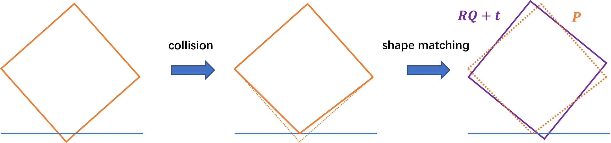

# 特征值分解与主成分分析（代码题）
## 介绍
在本次代码题中，你将基于 `python` 应用课上学到的特征值分解算法与主成分分析算法。

**本次代码所需环境**
```
taichi
numpy
pywavefront
matplotlib
```

## 特征值分解
请完成 `svd.py` 中的代码填空。你将实现课上介绍的基于 SVD 的 shape matching 算法（课件第21页-第27页），从而完成基于粒子的刚体仿真模拟的碰撞约束。

最终实现的效果如下图所示：


具体来说，我们这里模拟的刚体将视作由一堆粒子组成，这堆粒子就可以看成是集合 $Q$。在遇到碰撞或者外力的时候，一部分粒子就会改变其位置和速度等，这时候组成物体的这堆粒子集合我们就看成 $P$。因为物体是刚体，所以粒子之间的相对位置不能改变。为此，如下图所示，我们希望找到一个旋转变换 $R$ 和平移向量 $t$ 作用在 $Q$ 上使得其尽可能接近 $P$，从而将这个变换后得到的形状，即 $RQ+t$ 作为碰撞后的结果。



而衡量旋转变换 $R$ 和平移向量 $t$ 的标准就是通过求最小二乘法
$$\text{argmin} \sum_{i=0}^n (Rq_i+t-p_i)^2$$
得到（即 shape matching）。
## 主成分分析
请完成 `pca.py` 中的代码填空，从而能够绘制出 bunny 点云的包围盒。

最终实现的效果如下图所示：


## 提交
在完成了所有的代码填空后，请运行 python compress.py 来打包答案文件，将得到的 answer.zip 提交即可。